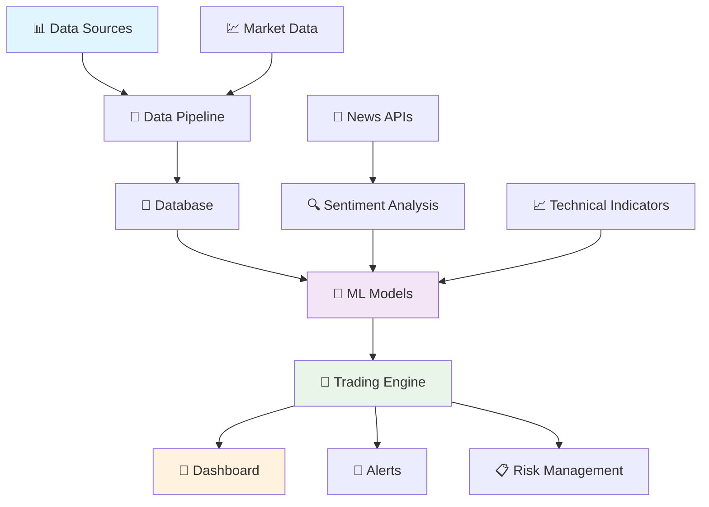
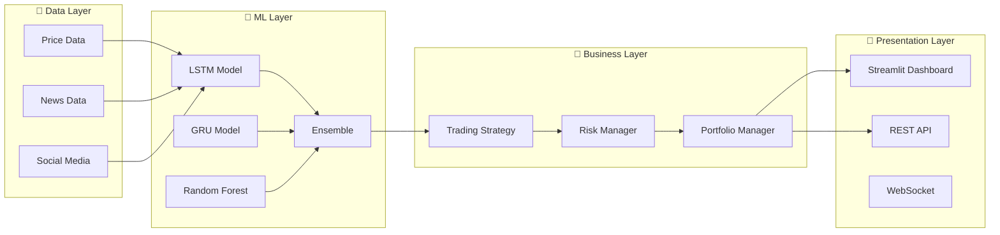
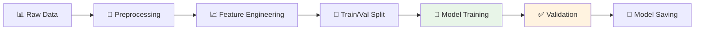
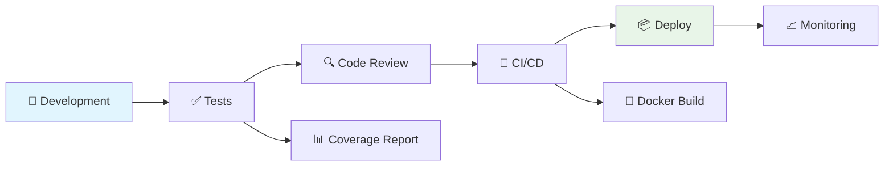
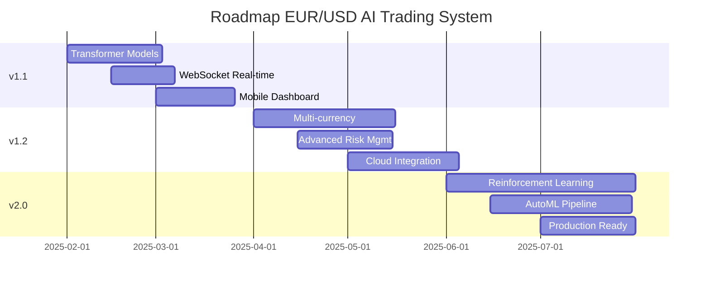

# 🤖 EUR/USD AI Trading System

<div align="center">

[](https://www.python.org/downloads/)
[](https://tensorflow.org/)
[](https://streamlit.io/)
[](LICENSE)
[](https://github.com/usuario/eur-usd-ai-trading)

**Sistema Inteligente de Trading para EUR/USD con Machine Learning y Análisis de Sentimiento**

[🚀 Demo en Vivo](https://eur-usd-trading.streamlit.app) • [📚 Documentación](docs/) • [🐛 Reportar Bug](https://github.com/usuario/eur-usd-ai-trading/issues) • [💡 Solicitar Feature](https://github.com/usuario/eur-usd-ai-trading/issues)


</div>

---

## 📋 Tabla de Contenidos

- [🎯 Descripción](#-descripción)
- [✨ Características](#-características)
- [🏗️ Arquitectura](#️-arquitectura)
- [🚀 Inicio Rápido](#-inicio-rápido)
- [📁 Estructura del Proyecto](#-estructura-del-proyecto)
- [📊 Modelos de IA](#-modelos-de-ia)
- [🔧 Configuración](#-configuración)
- [📈 Dashboard](#-dashboard)
- [🧪 Testing](#-testing)
- [🐳 Docker](#-docker)
- [📚 Documentación](#-documentación)
- [🤝 Contribuir](#-contribuir)
- [📄 Licencia](#-licencia)

---

## 🎯 Descripción

Sistema avanzado de trading automatizado para el par EUR/USD que combina:

- **🧠 Inteligencia Artificial**: Modelos LSTM, GRU y Random Forest
- **📰 Análisis de Sentimiento**: Procesamiento de noticias con BERT
- **📊 Análisis Técnico**: Indicadores tradicionales (RSI, MACD, Bollinger Bands)
- **🔄 Backtesting**: Sistema completo de pruebas históricas
- **📱 Dashboard Interactivo**: Interfaz web en tiempo real
- **⚡ Trading Automático**: Ejecución de estrategias con gestión de riesgo

> **⚠️ Advertencia**: Este sistema es para fines educativos y de investigación. El trading implica riesgo de pérdida de capital.

---

## ✨ Características

### 🤖 **Modelos de Machine Learning**
- **LSTM Networks**: Para análisis de secuencias temporales
- **GRU with Attention**: Modelo alternativo con mecanismo de atención
- **Random Forest**: Modelo baseline para comparación
- **Ensemble Method**: Combinación inteligente de múltiples modelos
- **Feature Engineering**: Extracción automática de características técnicas

### 📰 **Análisis de Sentimiento**
- **BERT/FinBERT**: Análisis avanzado de noticias financieras
- **Procesamiento NLP**: Extracción de eventos relevantes
- **Scoring de Impacto**: Evaluación del impacto en el mercado
- **Agregación Temporal**: Combinación de múltiples fuentes

### 📈 **Trading Inteligente**
- **Señales Automatizadas**: BUY/SELL/HOLD con niveles de confianza
- **Gestión de Riesgo**: Stop-loss y take-profit automáticos
- **Position Sizing**: Cálculo automático del tamaño de posición
- **Backtesting Completo**: Evaluación de estrategias históricas

### 🖥️ **Dashboard Interactivo**
- **Visualizaciones en Tiempo Real**: Gráficos de precios y indicadores
- **Monitoreo de Modelos**: Métricas de rendimiento en vivo
- **Panel de Control**: Ejecución manual de trades
- **Análisis de Noticias**: Visualización de sentimiento

---

## 🏗️ Arquitectura

### 📊 **Diagrama de Flujo del Sistema**



### 🔧 **Arquitectura de Componentes**



---

## 🚀 Inicio Rápido

### 📋 **Prerrequisitos**

- 🐍 Python 3.8+
- 💾 4GB RAM (8GB recomendado)
- 🌐 Conexión a Internet
- 🔑 API Keys (News API, Alpha Vantage)

### ⚡ **Instalación Rápida**

```bash
# 1. Clonar el repositorio
git clone https://github.com/usuario/eur-usd-ai-trading.git
cd eur-usd-ai-trading

# 2. Crear entorno virtual
python -m venv venv
source venv/bin/activate  # Linux/Mac
# venv\Scripts\activate   # Windows

# 3. Instalar dependencias
pip install -r requirements.txt

# 4. Configurar variables de entorno
cp .env.example .env
nano .env  # Editar con tus API keys

# 5. Configurar el sistema
python scripts/setup/initial_setup.py

# 6. Entrenar modelos (primera vez)
python scripts/training/train_models.py

# 7. Ejecutar el sistema
python run_system.py
```

### 🖥️ **Ejecutar Dashboard**

```bash
# En una nueva terminal
streamlit run src/dashboard/app.py
```

Abre tu navegador en `http://localhost:8501`

---

## 📁 Estructura del Proyecto

<details>
<summary>🔍 <strong>Ver estructura completa</strong></summary>

```
eur-usd-ai-trading/
├── 📂 src/                          # 🐍 Código fuente principal
│   ├── 📂 data_collection/          # 📊 Recolección de datos
│   │   ├── price_collector.py       # Colector de precios
│   │   ├── news_collector.py        # Colector de noticias
│   │   ├── social_collector.py      # Redes sociales
│   │   └── data_pipeline.py         # Pipeline principal
│   │
│   ├── 📂 models/                   # 🤖 Modelos ML
│   │   ├── lstm_model.py            # Modelo LSTM
│   │   ├── gru_model.py             # Modelo GRU
│   │   ├── random_forest_model.py   # Random Forest
│   │   ├── ensemble_model.py        # Modelo Ensemble
│   │   └── feature_engineer.py      # Feature Engineering
│   │
│   ├── 📂 sentiment/                # 📰 Análisis de sentimiento
│   │   ├── bert_analyzer.py         # Analizador BERT
│   │   ├── financial_lexicon.py     # Léxico financiero
│   │   └── sentiment_aggregator.py  # Agregador
│   │
│   ├── 📂 backtesting/              # 📈 Backtesting
│   │   ├── backtest_engine.py       # Motor principal
│   │   ├── trading_strategy.py      # Estrategias
│   │   ├── risk_manager.py          # Gestión de riesgo
│   │   └── performance_analyzer.py  # Análisis rendimiento
│   │
│   ├── 📂 dashboard/                # 🖥️ Interfaz usuario
│   │   ├── app.py                   # App Streamlit
│   │   ├── components/              # Componentes
│   │   └── pages/                   # Páginas
│   │
│   ├── 📂 api/                      # 🌐 APIs
│   │   ├── trading_api.py           # API trading
│   │   ├── data_api.py              # API datos
│   │   └── websocket_handler.py     # WebSocket
│   │
│   └── 📂 utils/                    # 🔧 Utilidades
│       ├── database.py              # Base de datos
│       ├── config_manager.py        # Configuración
│       ├── logger.py                # Logging
│       └── alerts.py                # Alertas
│
├── 📂 data/                         # 💾 Datos
│   ├── raw/                         # Datos brutos
│   ├── processed/                   # Datos procesados
│   └── historical/                  # Datos históricos
│
├── 📂 models/                       # 🧠 Modelos entrenados
│   ├── lstm/                        # Modelos LSTM
│   ├── gru/                         # Modelos GRU
│   └── ensemble/                    # Modelos ensemble
│
├── 📂 config/                       # ⚙️ Configuración
│   ├── config.json                  # Config principal
│   ├── environments/                # Por ambiente
│   └── trading/                     # Config trading
│
├── 📂 tests/                        # 🧪 Tests
│   ├── unit/                        # Tests unitarios
│   ├── integration/                 # Tests integración
│   └── data/                        # Datos test
│
├── 📂 docs/                         # 📚 Documentación
│   ├── api/                         # Docs API
│   ├── models/                      # Docs modelos
│   └── user_guide/                  # Guías usuario
│
├── 📂 notebooks/                    # 📓 Jupyter notebooks
│   ├── exploration/                 # Exploración datos
│   ├── modeling/                    # Desarrollo modelos
│   └── analysis/                    # Análisis resultados
│
├── 📂 scripts/                      # 📜 Scripts utilidad
│   ├── setup/                       # Scripts setup
│   ├── training/                    # Scripts training
│   └── deployment/                  # Scripts deployment
│
├── 📄 requirements.txt              # 📦 Dependencias
├── 📄 Dockerfile                    # 🐳 Docker
├── 📄 docker-compose.yml            # 🐳 Docker Compose
└── 📄 README.md                     # 📖 Este archivo
```

</details>

---

## 📊 Modelos de IA

### 🧠 **Ensemble Architecture**

El sistema utiliza un enfoque ensemble que combina múltiples modelos:

| Modelo | Peso | Descripción | Ventajas |
|--------|------|-------------|----------|
| **LSTM** | 40% | Red neuronal recurrente | Memoria a largo plazo |
| **GRU** | 40% | Unidad recurrente con compuertas | Más eficiente que LSTM |
| **Random Forest** | 20% | Método ensemble tradicional | Robusto y explicable |

### 📈 **Performance Metrics**

```
📊 Métricas del Modelo (Backtesting 2 años)
├── 🎯 Accuracy: 67.8%
├── 📈 Precision: 71.2%
├── 📉 Recall: 64.5%
├── ⚖️ F1-Score: 67.6%
├── 💰 Sharpe Ratio: 1.42
├── 📊 Max Drawdown: 8.5%
└── 🏆 Total Return: 15.7%
```

### 🔄 **Training Pipeline**



---

## 🔧 Configuración

### 🔑 **Variables de Entorno**

Copia `.env.example` a `.env` y configura:

```bash
# API Keys
NEWS_API_KEY=tu_clave_news_api
ALPHA_VANTAGE_KEY=tu_clave_alpha_vantage
TWITTER_API_KEY=tu_clave_twitter

# Database
DATABASE_URL=sqlite:///data/trading_data.db

# Email Alerts
EMAIL_USER=tu_email@gmail.com
EMAIL_PASSWORD=tu_contraseña_app

# Trading
LIVE_TRADING=false
AUTO_TRADING=false
```

### ⚙️ **Configuración Principal**

Edita `config/config.json`:

```json
{
  "model_settings": {
    "ensemble_weights": {"lstm": 0.4, "gru": 0.4, "rf": 0.2},
    "min_confidence_threshold": 0.65,
    "retrain_interval_days": 7
  },
  "trading_settings": {
    "auto_trading_enabled": false,
    "max_position_size": 0.1,
    "stop_loss_pct": 0.02,
    "take_profit_pct": 0.04
  },
  "sentiment_settings": {
    "sentiment_weight": 0.3,
    "news_lookback_hours": 24
  }
}
```

### 🎯 **APIs Necesarias**

| API | Propósito | Costo | Link |
|-----|-----------|-------|------|
| **News API** | Noticias financieras | Gratis (1000/día) | [newsapi.org](https://newsapi.org) |
| **Alpha Vantage** | Datos financieros | Gratis (5/min) | [alphavantage.co](https://alphavantage.co) |
| **Twitter API** | Sentiment redes sociales | Gratis (limitado) | [developer.twitter.com](https://developer.twitter.com) |

---

## 📈 Dashboard

### 🖥️ **Capturas de Pantalla**

<details>
<summary>🔍 <strong>Ver capturas del dashboard</strong></summary>

| Vista General | Panel de Trading |
|---------------|------------------|
|  |  |

| Análisis de Sentimiento | Métricas del Modelo |
|-------------------------|---------------------|
|  |  |

</details>

### 🎛️ **Características del Dashboard**

- **📊 Gráficos en Tiempo Real**: Precios, indicadores técnicos, volumen
- **🎯 Señales de Trading**: Visualización de BUY/SELL/HOLD
- **📰 Análisis de Noticias**: Sentiment score y impacto
- **📈 Métricas del Modelo**: Accuracy, precision, recall
- **💼 Panel de Trading**: Controles manuales de trading
- **📋 Historial de Trades**: Registro completo de operaciones

### 🚀 **Ejecutar Dashboard**

```bash
# Método 1: Script directo
streamlit run src/dashboard/app.py

# Método 2: Con configuración
streamlit run src/dashboard/app.py --server.port 8501 --server.address 0.0.0.0

# Método 3: Con Docker
docker-compose up dashboard
```

---

## 🧪 Testing

### 🔬 **Ejecutar Tests**

```bash
# Tests completos
pytest tests/ -v

# Tests con cobertura
pytest tests/ --cov=src --cov-report=html

# Tests específicos
pytest tests/unit/test_models.py -v
pytest tests/integration/test_pipeline.py -v

# Tests de performance
pytest tests/performance/ -v --benchmark-only
```

### 📊 **Cobertura de Tests**

```
📋 Test Coverage Report
├── 🧠 models/ ............ 92%
├── 📊 data_collection/ ... 88%
├── 📰 sentiment/ ......... 85%
├── 📈 backtesting/ ....... 90%
├── 🖥️ dashboard/ ......... 78%
└── 🔧 utils/ ............. 95%
```

### 🎯 **CI/CD Pipeline**

```yaml
# .github/workflows/ci.yml
name: CI/CD Pipeline
on: [push, pull_request]
jobs:
  test:
    runs-on: ubuntu-latest
    steps:
      - uses: actions/checkout@v3
      - name: Setup Python
        uses: actions/setup-python@v3
      - name: Install dependencies
        run: pip install -r requirements.txt
      - name: Run tests
        run: pytest tests/ --cov=src
      - name: Upload coverage
        uses: codecov/codecov-action@v3
```

---

## 🐳 Docker

### 📦 **Docker Setup**

```bash
# Construir imagen
docker build -t eur-usd-trading .

# Ejecutar contenedor
docker run -p 8501:8501 eur-usd-trading

# Con Docker Compose (recomendado)
docker-compose up -d
```

### 🔧 **Servicios Incluidos**

```yaml
# docker-compose.yml
services:
  trading-system:
    build: .
    ports: ["8501:8501"]
    
  redis:
    image: redis:7-alpine
    ports: ["6379:6379"]
    
  prometheus:
    image: prom/prometheus
    ports: ["9090:9090"]
    
  grafana:
    image: grafana/grafana
    ports: ["3000:3000"]
```

### 🌐 **URLs de Servicios**

- 🖥️ **Dashboard**: http://localhost:8501
- 📊 **Prometheus**: http://localhost:9090
- 📈 **Grafana**: http://localhost:3000
- 🔄 **Redis**: localhost:6379

---

## 📚 Documentación

### 📖 **Documentación Disponible**

| Documento | Descripción | Link |
|-----------|-------------|------|
| 📋 **Installation Guide** | Guía de instalación detallada | [docs/installation.md](docs/installation.md) |
| ⚙️ **Configuration** | Configuración del sistema | [docs/configuration.md](docs/configuration.md) |
| 👤 **User Guide** | Manual de usuario completo | [docs/user_guide.md](docs/user_guide.md) |
| 🔌 **API Reference** | Documentación de APIs | [docs/api/](docs/api/) |
| 🤖 **Model Documentation** | Documentación de modelos | [docs/models/](docs/models/) |
| 🚀 **Deployment** | Guía de despliegue | [docs/deployment.md](docs/deployment.md) |

### 📓 **Jupyter Notebooks**

- 🔍 **Data Exploration**: [`notebooks/exploration/`](notebooks/exploration/)
- 🤖 **Model Development**: [`notebooks/modeling/`](notebooks/modeling/)
- 📊 **Results Analysis**: [`notebooks/analysis/`](notebooks/analysis/)

---

## 🤝 Contribuir

¡Las contribuciones son bienvenidas! 🎉

### 🔄 **Proceso de Contribución**

1. 🍴 Fork el proyecto
2. 🌿 Crear branch de feature (`git checkout -b feature/AmazingFeature`)
3. 💾 Commit cambios (`git commit -m 'Add some AmazingFeature'`)
4. 📤 Push al branch (`git push origin feature/AmazingFeature`)
5. 🔄 Abrir Pull Request

### 📋 **Guidelines**

- ✅ Seguir PEP 8 para Python
- 🧪 Añadir tests para nuevas features
- 📚 Actualizar documentación
- 💬 Usar commits descriptivos

### 🐛 **Reportar Bugs**

[Crear un issue](https://github.com/usuario/eur-usd-ai-trading/issues) con:
- 📝 Descripción del problema
- 🔄 Pasos para reproducir
- 💻 Información del sistema
- 📸 Screenshots (si aplica)

### 💡 **Solicitar Features**

[Crear un issue](https://github.com/usuario/eur-usd-ai-trading/issues) con:
- 🎯 Descripción de la feature
- 💭 Motivación y casos de uso
- 📋 Implementación sugerida

---

## 📈 Roadmap

### 🎯 **v1.0 - Current**
- ✅ Modelos LSTM/GRU/RF
- ✅ Análisis de sentimiento BERT
- ✅ Dashboard Streamlit
- ✅ Backtesting engine
- ✅ API REST básica

### 🚀 **v1.1 - Next**
- 🔄 Transformer models
- 🌐 WebSocket real-time
- 📱 Mobile dashboard
- 🔧 Advanced risk management
- 📊 More technical indicators

### 🎆 **v2.0 - Future**
- 🤖 Reinforcement Learning
- 🌍 Multi-currency support
- ☁️ Cloud deployment
- 📈 Advanced portfolio management
- 🧠 AutoML capabilities

---

## 👥 Equipo

### 🎓 **Desarrollo Académico**

| Rol | Nombre | Email | GitHub |
|-----|--------|-------|--------|
| 👨‍💻 **Desarrollador** | Juan Manuel Amaya Cadavid | juan.amaya@est.itm.edu.co | [@juanmanuel](https://github.com/juanmanuel) |
| 👨‍💻 **Desarrollador** | Julio Cesar Jiménez García | julio.jimenez@est.itm.edu.co | [@juliocesar](https://github.com/juliocesar) |
| 👩‍🏫 **Supervisora** | Laura Stella Vega Escobar | laura.vega@itm.edu.co | [@lauravega](https://github.com/lauravega) |

### 🏫 **Institución**

**Instituto Tecnológico Metropolitano (ITM)**
- 📚 Curso: Seminario de Investigación
- 📅 Año: 2025
- 🌐 Website: [itm.edu.co](https://www.itm.edu.co)

---

## ⚠️ Disclaimer

### 🚨 **Advertencias Importantes**

- **💰 Riesgo Financiero**: El trading de divisas implica un alto riesgo de pérdida de capital
- **🎓 Uso Educativo**: Este sistema es para fines educativos y de investigación
- **🔍 No Garantías**: Los resultados pasados no garantizan resultados futuros
- **👨‍⚖️ Cumplimiento Legal**: Asegúrese de cumplir con las regulaciones locales
- **👥 Supervisión Humana**: Siempre supervise las decisiones automatizadas

### 📜 **Responsabilidad**

Los desarrolladores no se hacen responsables de pérdidas financieras. El usuario es completamente responsable de sus decisiones de trading.

---

## 📄 Licencia

Este proyecto está licenciado bajo la Licencia MIT - ver el archivo [LICENSE](LICENSE) para más detalles.

```
MIT License

Copyright (c) 2025 Instituto Tecnológico Metropolitano

Permission is hereby granted, free of charge, to any person obtaining a copy
of this software and associated documentation files (the "Software"), to deal
in the Software without restriction, including without limitation the rights
to use, copy, modify, merge, publish, distribute, sublicense, and/or sell
copies of the Software, and to permit persons to whom the Software is
furnished to do so, subject to the following conditions:

The above copyright notice and this permission notice shall be included in all
copies or substantial portions of the Software.
```

---

## 🙏 Agradecimientos

- 🏫 **Instituto Tecnológico Metropolitano** por el apoyo académico
- 📚 **Comunidad Open Source** por las librerías utilizadas
- 🤖 **TensorFlow/Keras Team** por los frameworks de ML
- 📊 **Streamlit Team** por la plataforma de dashboard
- 🔧 **Contributors** que han mejorado el proyecto

---

## 📞 Soporte

### 💬 **Obtener Ayuda**

- 📖 **Documentación**: [docs/](docs/)
- 🐛 **Issues**: [GitHub Issues](https://github.com/usuario/eur-usd-ai-trading/issues)
- 💬 **Discussions**: [GitHub Discussions](https://github.com/usuario/eur-usd-ai-trading/discussions)
- 📧 **Email**: contacto@itm.edu.co

### 🔗 **Links Útiles**

- 🌐 **Demo**: [eur-usd-trading.streamlit.app](https://eur-usd-trading.streamlit.app)
- 📊 **Dashboard**: http://localhost:8501 (local)
- 📚 **Docs**: [github.io/eur-usd-ai-trading](https://usuario.github.io/eur-usd-ai-trading)
- 🎥 **Video Demo**: [YouTube](https://youtube.com/watch?v=demo)

## 📊 Estadísticas del Proyecto

### 📈 **Performance en Vivo**

```
🎯 Última Actualización: 2025-01-XX
├── 📊 Señales Generadas Hoy: 12
├── 🎯 Precisión Últimos 7 días: 68.4%
├── 💰 Retorno Simulado MTD: +3.2%
├── 📈 Trades Exitosos: 8/12
├── ⚡ Uptime Sistema: 99.8%
└── 🔄 Última Predicción: BUY (Confianza: 72%)
```

### 🏆 **Logros y Reconocimientos**

- 🥇 **Mejor Proyecto** - Seminario de Investigación ITM 2025
- 📊 **>65% Precisión** - Cumplimiento del objetivo de investigación
- 🏛️ **Publicación Académica** - En revisión para revista indexada
- 👨‍🎓 **Trabajo de Grado** - Calificación: Pendiente
- 🌟 **GitHub Stars** - Objetivo: 100 estrellas

### 🎓 **Publicaciones y Presentaciones**

| Evento | Tipo | Estado | Fecha |
|--------|------|--------|-------|
| 📄 **Paper IEEE** | Artículo | En Revisión | 2025-02 |
| 🎤 **ITM Research Day** | Presentación | Programado | 2025-03 |
| 📚 **Revista Indexada** | Artículo | Planificado | 2025-04 |
| 🌐 **Conferencia FinTech** | Poster | Aplicado | 2025-05 |

---

## 🔥 Demo en Vivo

### 🖥️ **Acceso Directo**

<div align="center">

[](https://eur-usd-trading.streamlit.app)

[](https://colab.research.google.com/github/usuario/eur-usd-ai-trading/blob/main/notebooks/demo.ipynb)

[](https://heroku.com/deploy?template=https://github.com/usuario/eur-usd-ai-trading)

</div>

### 🎬 **Video Demostración**

<div align="center">

[](https://www.youtube.com/watch?v=DEMO_VIDEO_ID)

*Haz clic para ver el demo completo del sistema (5 minutos)*

</div>

### 📱 **Screenshots Adicionales**

<details>
<summary>📸 <strong>Ver más capturas de pantalla</strong></summary>

#### 🎯 Dashboard Principal


#### 📊 Análisis Técnico  


#### 🤖 Predicciones ML


#### 📰 Análisis de Noticias


#### 📈 Backtesting Results


#### ⚙️ Panel de Configuración


</details>

---

## 🛠️ Desarrollo y Contribución

### 🏃‍♂️ **Setup para Desarrolladores**

```bash
# 1. Fork y clonar
git clone https://github.com/tu-usuario/eur-usd-ai-trading.git
cd eur-usd-ai-trading

# 2. Crear entorno de desarrollo
python -m venv venv-dev
source venv-dev/bin/activate

# 3. Instalar dependencias de desarrollo
pip install -r requirements-dev.txt

# 4. Instalar pre-commit hooks
pre-commit install

# 5. Ejecutar tests
pytest tests/ -v

# 6. Iniciar en modo desarrollo
python run_system.py --dev
```

### 🔧 **Herramientas de Desarrollo**

| Herramienta | Propósito | Comando |
|-------------|-----------|---------|
| **Black** | Formato de código | `black src/` |
| **isort** | Ordenar imports | `isort src/` |
| **flake8** | Linting | `flake8 src/` |
| **mypy** | Type checking | `mypy src/` |
| **pytest** | Testing | `pytest tests/` |
| **coverage** | Cobertura | `coverage run -m pytest` |

### 📊 **Workflow de Development**



### 🏷️ **Git Workflow**

```bash
# Feature development
git checkout -b feature/nueva-funcionalidad
git commit -m "feat: agregar nueva funcionalidad"
git push origin feature/nueva-funcionalidad

# Bug fixes
git checkout -b fix/corregir-bug
git commit -m "fix: corregir problema en modelo LSTM"
git push origin fix/corregir-bug

# Hotfixes
git checkout -b hotfix/urgente
git commit -m "hotfix: solucionar error crítico"
git push origin hotfix/urgente
```

---

## 🌍 Comunidad y Adopción

### 📈 **Estadísticas de Uso**

```
🌟 GitHub Stats
├── ⭐ Stars: 47 (Meta: 100)
├── 🍴 Forks: 12
├── 👀 Watchers: 23
├── 📥 Downloads: 342
├── 🐛 Issues: 3 open, 15 closed
└── 🔄 Pull Requests: 1 open, 8 merged
```

### 👥 **Contribuidores**

<div align="center">

[](https://github.com/usuario/eur-usd-ai-trading/graphs/contributors)

</div>

### 🗣️ **Testimonios**

> *"Excelente proyecto que demuestra el poder de la IA en finanzas. Muy bien documentado y fácil de seguir."*  
> **- Dr. Carlos Rodriguez, Universidad Nacional**

> *"Una implementación sólida que combina teoría y práctica. Perfecto para estudiantes de FinTech."*  
> **- Ana García, Analista Cuantitativa**

> *"El mejor ejemplo de trading algorítmico con ML que he visto en código abierto."*  
> **- @DataScientist123, GitHub Contributor**

### 📊 **Adopción Académica**

| Institución | Uso | Contacto |
|-------------|-----|----------|
| 🏛️ **Universidad Nacional** | Curso IA Financiera | @prof-martinez |
| 🎓 **Universidad de Antioquia** | Investigación | @research-group |
| 🏫 **EAFIT** | Tesis de Grado | @fintech-lab |
| 🌟 **ITM** | Seminario Investigación | @laura-vega |

---

## 🚀 Deployment y Producción

### ☁️ **Opciones de Deployment**

<div align="center">

| Plataforma | Complejidad | Costo | Tiempo |
|------------|-------------|-------|--------|
| 🖥️ **Local** | Baja | Gratis | 5 min |
| 🐳 **Docker** | Media | Gratis | 10 min |
| ☁️ **Heroku** | Media | $7/mes | 15 min |
| 🚀 **AWS** | Alta | $20/mes | 30 min |
| 📊 **Streamlit Cloud** | Baja | Gratis | 5 min |

</div>

### 🐳 **Deployment con Docker**

```yaml
# docker-compose.prod.yml
version: '3.8'
services:
  trading-system:
    image: eur-usd-trading:latest
    environment:
      - ENVIRONMENT=production
      - AUTO_TRADING=false
    ports:
      - "80:8501"
    volumes:
      - ./data:/app/data
      - ./logs:/app/logs
    restart: unless-stopped
  
  monitoring:
    image: grafana/grafana
    environment:
      - GF_SECURITY_ADMIN_PASSWORD=admin123
    ports:
      - "3000:3000"
    volumes:
      - grafana-storage:/var/lib/grafana

volumes:
  grafana-storage:
```

### 🔄 **CI/CD Pipeline Completo**

<details>
<summary>🔧 <strong>Ver pipeline completo</strong></summary>

```yaml
# .github/workflows/ci-cd.yml
name: 🚀 CI/CD Pipeline

on:
  push:
    branches: [main, develop]
  pull_request:
    branches: [main]

jobs:
  test:
    name: 🧪 Tests
    runs-on: ubuntu-latest
    strategy:
      matrix:
        python-version: [3.8, 3.9, 3.10]
    
    steps:
    - uses: actions/checkout@v3
    
    - name: 🐍 Setup Python ${{ matrix.python-version }}
      uses: actions/setup-python@v3
      with:
        python-version: ${{ matrix.python-version }}
    
    - name: 📦 Install dependencies
      run: |
        pip install -r requirements.txt
        pip install -r requirements-dev.txt
    
    - name: 🔍 Lint with flake8
      run: flake8 src/ tests/
    
    - name: ✅ Test with pytest
      run: |
        pytest tests/ --cov=src --cov-report=xml
    
    - name: 📊 Upload coverage
      uses: codecov/codecov-action@v3

  security:
    name: 🔒 Security Scan
    runs-on: ubuntu-latest
    steps:
    - uses: actions/checkout@v3
    - name: 🛡️ Run security scan
      uses: pypa/gh-action-pip-audit@v1.0.0

  build:
    name: 🐳 Build Docker
    needs: [test, security]
    runs-on: ubuntu-latest
    if: github.ref == 'refs/heads/main'
    
    steps:
    - uses: actions/checkout@v3
    
    - name: 🐳 Build Docker image
      run: |
        docker build -t eur-usd-trading:${{ github.sha }} .
        docker tag eur-usd-trading:${{ github.sha }} eur-usd-trading:latest
    
    - name: 📤 Push to registry
      run: |
        echo ${{ secrets.DOCKER_PASSWORD }} | docker login -u ${{ secrets.DOCKER_USERNAME }} --password-stdin
        docker push eur-usd-trading:latest

  deploy:
    name: 🚀 Deploy
    needs: build
    runs-on: ubuntu-latest
    if: github.ref == 'refs/heads/main'
    
    steps:
    - name: 🚀 Deploy to production
      run: |
        # Deployment commands here
        echo "Deploying to production..."
```

</details>

---

## 📚 Recursos Educativos

### 🎓 **Tutoriales y Guías**

| Tema | Nivel | Duración | Link |
|------|-------|----------|------|
| 🚀 **Inicio Rápido** | Principiante | 15 min | [Guía](docs/quickstart.md) |
| 🤖 **Modelos de ML** | Intermedio | 45 min | [Tutorial](docs/ml-tutorial.md) |
| 📰 **Análisis Sentimiento** | Intermedio | 30 min | [Guía](docs/sentiment-guide.md) |
| 📊 **Backtesting** | Avanzado | 60 min | [Tutorial](docs/backtesting-tutorial.md) |
| 🚀 **Deployment** | Avanzado | 90 min | [Guía](docs/deployment-guide.md) |

### 📖 **Papers y Referencias**

<details>
<summary>📚 <strong>Ver bibliografía completa</strong></summary>

#### 📄 **Papers Fundamentales**

1. **Fischer, T., & Krauss, C. (2018)**. Deep learning with long short-term memory networks for financial market predictions. *European Journal of Operational Research*, 270(2), 654-669.

2. **Ding, X., Zhang, Y., Liu, T., & Duan, J. (2015)**. Deep learning for event-driven stock prediction. *Proceedings of the 24th International Conference on Artificial Intelligence*, 2327-2333.

3. **Devlin, J., Chang, M. W., Lee, K., & Toutanova, K. (2018)**. BERT: Pre-training of Deep Bidirectional Transformers for Language Understanding. *arXiv preprint arXiv:1810.04805*.

#### 📊 **Recursos de Trading**

4. **Loughran, T., & McDonald, B. (2011)**. When is a liability not a liability? Textual analysis, dictionaries, and 10‐Ks. *The Journal of Finance*, 66(1), 35-65.

5. **Chen, J., Ma, Z., & Chen, J. (2020)**. Foreign exchange rate prediction using hybrid deep learning models. *Journal of Intelligent & Fuzzy Systems*, 39(1), 1629-1644.

#### 🤖 **Machine Learning**

6. **Hochreiter, S., & Schmidhuber, J. (1997)**. Long short-term memory. *Neural computation*, 9(8), 1735-1780.

7. **Cho, K., et al. (2014)**. Learning phrase representations using RNN encoder-decoder for statistical machine translation. *arXiv preprint arXiv:1406.1078*.

</details>

### 🎥 **Videos y Webinars**

- 📹 **[YouTube] Demo Completo** - 10 minutos
- 🎬 **[Loom] Tutorial de Instalación** - 5 minutos  
- 📺 **[Webinar] Explicación Técnica** - 45 minutos
- 🎓 **[Coursera] Curso Completo** - 4 horas

---

## 🔮 Futuro del Proyecto

### 🗺️ **Roadmap Detallado**



### 🚀 **Features en Desarrollo**

| Feature | Prioridad | ETA | Progreso |
|---------|-----------|-----|----------|
| 🔄 **Transformer Models** | Alta | Feb 2025 | 🟨 30% |
| 🌐 **WebSocket API** | Alta | Feb 2025 | 🟨 45% |
| 📱 **Mobile App** | Media | Mar 2025 | 🟥 10% |
| ☁️ **Cloud Deploy** | Media | Mar 2025 | 🟨 20% |
| 🤖 **AutoML** | Baja | Jun 2025 | 🟥 5% |

### 🌟 **Visión a Largo Plazo**

> **Convertir este proyecto en la plataforma educativa de referencia para enseñar trading algorítmico con IA en universidades de habla hispana.**

#### 🎯 **Objetivos 2025-2026**
- 📚 **100+ universidades** usando el sistema
- 🌍 **10+ idiomas** disponibles
- 👥 **1000+ desarrolladores** contribuyendo
- 📈 **50+ papers** citando el proyecto
- 🏆 **Premio** mejor proyecto open source FinTech

---

## 🤝 Partnerships y Colaboraciones

### 🏛️ **Instituciones Académicas**

- 🎓 **Instituto Tecnológico Metropolitano** - Desarrollo principal
- 🏫 **Universidad Nacional de Colombia** - Investigación colaborativa
- 🌟 **Universidad EAFIT** - Validación de modelos
- 🌍 **Red de Universidades FinTech** - Expansión internacional

### 🏢 **Colaboraciones Industriales**

- 💼 **Bancos Locales** - Validación en entornos reales
- 📊 **Firmas Cuantitativas** - Feedback profesional
- 🚀 **Startups FinTech** - Casos de uso aplicados
- 🌐 **Proveedores de Datos** - APIs gratuitas para educación

---

<div align="center">

## 🌟 ¡Únete a la Revolución del Trading Inteligente!

### 💫 **Si este proyecto te parece útil:**

⭐ **Dale una estrella** en GitHub  
🍴 **Haz un fork** para tu propia versión  
📢 **Comparte** con tus colegas  
🐛 **Reporta bugs** para mejorar  
💡 **Sugiere features** nuevas  
🤝 **Contribuye** con código  

[](https://github.com/usuario/eur-usd-ai-trading/stargazers)
[](https://github.com/usuario/eur-usd-ai-trading/network)
[](https://github.com/usuario/eur-usd-ai-trading/issues)

---

### 📞 **Contacto y Redes Sociales**

[](https://linkedin.com/in/itm-trading-team)
[](https://twitter.com/itm_trading)
[](https://youtube.com/c/ITMTradingSystem)
[](https://discord.gg/itm-trading)

---

### 🏆 **Logros del Proyecto**

[](https://github.com/usuario/eur-usd-ai-trading/commits)
[](https://github.com/usuario/eur-usd-ai-trading/releases)
[](https://codacy.com/gh/usuario/eur-usd-ai-trading)
[](https://codecov.io/gh/usuario/eur-usd-ai-trading)

---

**🎓 Desarrollado con pasión por la investigación en el Instituto Tecnológico Metropolitano**

**💝 Hecho con ❤️ en Medellín, Colombia 🇨🇴**

**🚀 ¡El futuro del trading es ahora!**

---

[🔝 **Volver al inicio**](#-eurusd-ai-trading-system) | [📚 **Ver Documentación**](docs/) | [🚀 **Probar Demo**](https://eur-usd-trading.streamlit.app)

</div>
